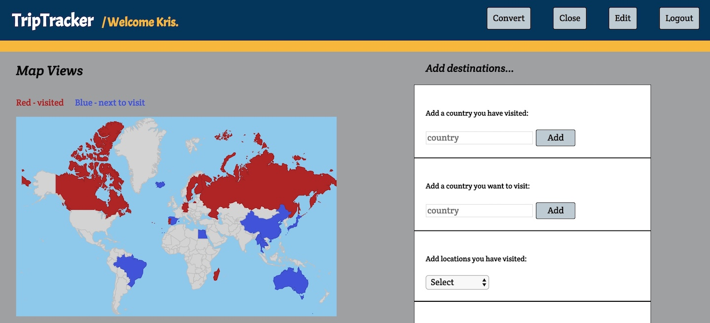
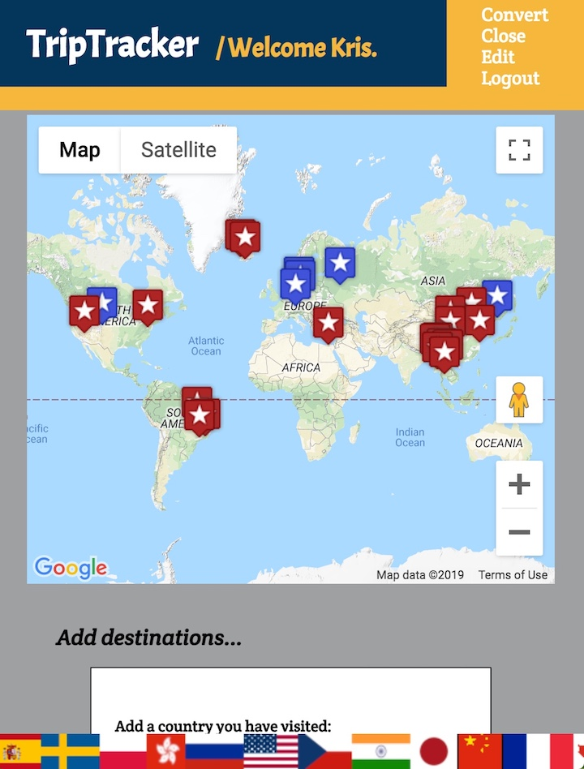
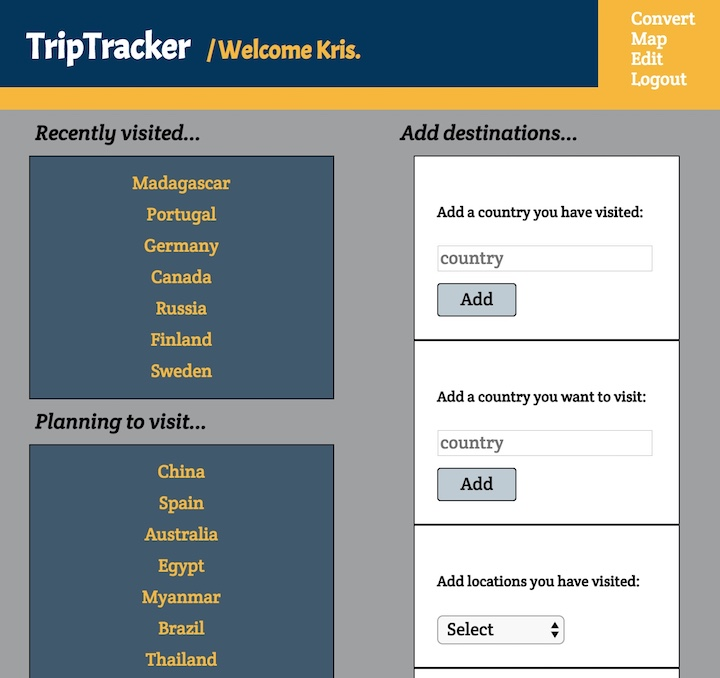

# TripTracker

---

**Author: Kris Sakarias**

**Version: 2.0.0**

---

## Overview

Track your travels with TripTracker. Create an account and add countries, cities, and other locations that you have visited or are planning on visiting. Plot them on a map to see a visual representation of your journey.

The user will interact with a frontend built with **React** and **Redux**, transpiled from modern Javascript (**ES6**) with **Babel**, and bundled with **Webpack**. 

The server is built with **Node**, **Express**, and manages data storage with **MongoDB** and **Mongoose**.

See subdirectory READMEs for further documentation.

---
## A Quick Look

Visualize your past and future travels.

Add and pin cities or locations you have visited.

---
### Testing
---

Server unit testing is done with `Mocha` and `Chai`. 96% of server code is covered.

Run tests with `cd back && npm run test`.

Front-end testing of components, actions, and reducers is done with `Jest`.
